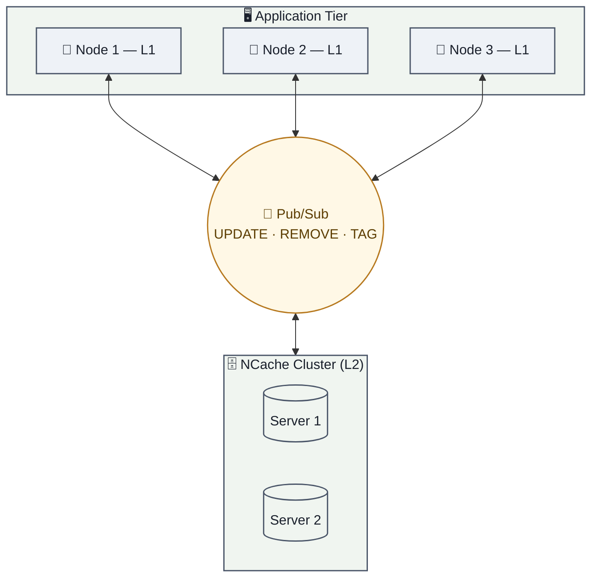

<div align="center">

# ⚡ NCache.OSS.Caching.Hybrid

### An implementation of Microsoft's `HybridCache` — backed by NCache


</div>

| ⚡ TL;DR (quick version) |
|---|
| A is a drop-in implementation of Microsoft's `HybridCache` abstraction, powered by NCache as the L2 layer. On top of the standard L1 (in-process) + L2 (distributed) behavior, it adds **real-time synchronization between every node's L1 cache**, using NCache's built-in Pub/Sub — something the default Microsoft implementation does not do. |

With .NET 9, Microsoft introduced [`HybridCache`](https://learn.microsoft.com/en-us/aspnet/core/performance/caching/hybrid) — an abstraction for combining an in-process (L1) cache with a distributed (L2) cache behind a single, simple API, along with a default implementation.

NCache.OSS.Caching.Hybrid  is an alternative implementation of that same abstraction, using NCache as the distributed layer. Anywhere your application depends on `HybridCache`, you can register this package instead and get everything the abstraction promises — plus a few things the default implementation doesn't do.

## 🖼️ Getting Started

Registration is a single call, and from then on your application just depends on `HybridCache` as usual:

```csharp
var builder = WebApplication.CreateBuilder(args);

builder.Services.AddNCacheHybridCache(builder.Configuration);
```

```csharp
public class SomeService(HybridCache cache)
{
    private readonly HybridCache _cache = cache;

    public async Task<Product> GetProductAsync(int productId, CancellationToken token = default)
    {
        return await _cache.GetOrCreateAsync(
            $"product:{productId}",
            async ct => await _database.GetProductAsync(productId, ct),
            cancellationToken: token
        );
    }
}
```

Underneath, NCache is doing the work — but your code only ever talks to `HybridCache`. (Full setup details are in [Installation](#-installation) and [Quick Start](#-quick-start) below.)

---

## 🆎 Feature Comparison

The default Microsoft implementation of `HybridCache` gives you:

- an L1 (in-process, memory) cache
- an L2 (distributed) cache, via `IDistributedCache`
- cache stampede protection, scoped to a single node
- tag-based invalidation

NCache.OSS.Caching.Hybrid gives you all of that, plus:

- **real-time L1 ⇄ L2 synchronization across every node** — see below
- cross-node `REMOVE` and wildcard (`*`) invalidation
- bulk key / tag operations, batched into a single round-trip and a single sync message
- fine-grained `HybridCacheEntryFlags` for per-call control over which layer is read/written
- structured logging via `ILogger`, with a dedicated diagnostic category


---

## 📢 L1 ⇄ L2 Synchronization

This is the main thing this package adds on top of `HybridCache`: **every node's L1 cache stays in sync, in real time, without you doing anything extra.**

### How it works

NCache clusters have a built-in Pub/Sub messaging layer. This package uses it automatically — there's no separate backplane or messaging broker to stand up and wire in yourself. As soon as you point multiple application instances at the same NCache cluster, they're synchronized.



Concretely, here's what triggers a sync message and what every other node does with it:

| Operation | What's published | What other nodes do |
|---|---|---|
| `SetAsync` | `UPDATE` for the key | Refresh or invalidate their local L1 entry for that key |
| `RemoveAsync` (single or bulk) | `REMOVE` for the key(s) | Evict the key(s) from their local L1 |
| `RemoveByTagAsync` | `TAG` invalidation, with a timestamp | Treat any L1/L2 entry created before that timestamp as stale |
| `RemoveByTagAsync("*")` | `WILDCARD` invalidation | Treat every entry as stale, cluster-wide |

Tag invalidations don't physically delete anything — a timestamp is persisted in L2 (as a sentinel key) and broadcast to every node. On the next read, any entry created before that timestamp is treated as invalid and re-fetched, regardless of which node originally cached it. This means tag invalidation is both instant across the cluster and durable, since the sentinel lives in L2, not just in memory on one node.

The net effect: a write, remove, or invalidation on any one node is reflected on every other node within the cluster in real time — you don't write any additional code for this, and there's no separate component to configure. It falls out of registering the package against your NCache cluster.

---

## 🚀 On Top of HybridCache

A few other things this implementation adds beyond the base `HybridCache` contract:

- **Bulk operations** — passing multiple keys or tags to `RemoveAsync` / `RemoveByTagAsync` batches them into a single L1/L2 operation and a single Pub/Sub message, instead of one round-trip per item.
- **Fine-grained cache flags** — `HybridCacheEntryFlags` lets you disable L1 or L2 reads/writes independently, per call, so hot-but-volatile data can skip L1 while long-lived data can skip L2.
- **Independent expirations** — `Expiration` (L2) and `LocalCacheExpiration` (L1) are set separately, so your distributed copy can safely outlive your local copy (or vice versa).
- **Structured, diagnosable logging** — every layer logs through `ILogger`, with a dedicated category for debug-level tracing of cache/sync behavior when you need to troubleshoot.

---

## ✨ Features

<table>
<tr>
<td valign="top" width="50%">

### 🔀 Synchronization
- **📡 Pub/Sub L1 Sync** — every node's local cache stays consistent automatically
- **🔁 Cross-Node Invalidation** — `RemoveAsync`, `RemoveByTagAsync`, and wildcard `*` flushes propagate instantly
- **🧭 Sentinel-Based Tag Tracking** — tag invalidation timestamps persisted in L2 for durability

### 🚀 Performance
- **🧠 L1/L2 Hybrid Caching** — blazing-fast local reads backed by distributed durability
- **🛡️ Cache Stampede Prevention** — semaphore-based locking with `TRY/FINALLY` safety
- **📦 Bulk Operations** — `RemoveBulk` / `GetBulk` under the hood for multi-key/tag ops

</td>
<td valign="top" width="50%">

### 🏷️ Flexibility
- **🏷️ Tag-Based Invalidation** — logical deletion, no physical scan required
- **🎚️ Configurable Cache Flags** — fine-grained control over L1/L2 read/write behavior
- **Ⓜ️ Microsoft HybridCache Compatible** — true drop-in for `HybridCache`

### 🔭 Observability
- **📜 Structured Logging** — full `ILogger` integration
- **🩺 Diagnostic Logging** — dedicated debug category for troubleshooting
- **⏱️ Independent L1/L2 Expiration** — tune freshness vs. durability separately

</td>
</tr>
</table>

---

## 📦 Package Versions

| Package | Version |
|---|---|
| `NCache.OSS.Caching.Hybrid` |  `5.3.6.1` |
| `Alachisoft.NCache.Opensource.SDK` | `>= 5.3.6.2` |
| `Microsoft.Extensions.Caching.Hybrid` | `>= 10.4.0` |

---

## 🚀 Installation

```bash
dotnet add package NCache.OSS.Caching.Hybrid
```

```powershell
Install-Package NCache.OSS.Caching.Hybrid
```

### ✅ Prerequisites

| # | Requirement |
|---|---|
| 1 | 🖧 A running **NCache Server** cluster |
| 2 | 💾 An **In-Proc** cache configured for L1 |
| 3 | 🗄️ A **Replicated** cache configured for L2 |

---

## ⚡ Quick Start

### 1️⃣ Configure `appsettings.json`

```json
{
  "NCacheHybridCacheConfiguration": {
    "LocalCacheName": "myLocalCache",
    "DistributedCacheName": "myDistributedCache",
    "ServerList": [
      { "Ip": "192.168.1.100", "Port": 9800 },
      { "Ip": "192.168.1.101", "Port": 9800 }
    ],
    "EnableLogs": true
  }
}
```

### 2️⃣ Register services in `Program.cs`

<details open>
<summary><b>Using <code>IConfiguration</code></b></summary>

```csharp
var builder = WebApplication.CreateBuilder(args);

// Option 1: Bind from configuration section
var config = builder.Configuration.GetSection("NCacheHybridCacheConfiguration");
builder.Services.AddNCacheHybridCache(config);

// Option 2: Bind directly (auto-detects section name)
builder.Services.AddNCacheHybridCache(builder.Configuration);
```

</details>

<details>
<summary><b>Using an action delegate</b></summary>

```csharp
builder.Services.AddNCacheHybridCache(options =>
{
    options.LocalCacheName = "myLocalCache";
    options.DistributedCacheName = "myDistributedCache";
    options.ServerList = new List<ServerConfig>
    {
        new ServerConfig { Ip = "192.168.1.100", Port = 9800 }
    };
    options.EnableLogs = true;
});
```

</details>

### 3️⃣ Inject and use `HybridCache`

```csharp
public class ProductService
{
    private readonly HybridCache _cache;

    public ProductService(HybridCache cache) => _cache = cache;

    public async Task<Product> GetProductAsync(int productId)
    {
        return await _cache.GetOrCreateAsync(
            key: $"product:{productId}",
            state: productId,
            factory: async (id, ct) => await _database.GetProductAsync(id, ct),
            tags: new[] { "products", $"category:{product.CategoryId}" }
        );
    }
}
```

---

## 📚 API Reference

<details>
<summary><h3>🔍 <code>GetOrCreateAsync</code> — retrieve or create with L1/L2 fallback</h3></summary>

```csharp
ValueTask<T> GetOrCreateAsync<TState, T>(
    string key,
    TState state,
    Func<TState, CancellationToken, ValueTask<T>> factory,
    HybridCacheEntryOptions? options = null,
    IEnumerable<string>? tags = null,
    CancellationToken cancellationToken = default
);
```

| Parameter | Description |
|---|---|
| `key` | Unique cache key (null/empty handled gracefully) |
| `state` | State passed to the factory |
| `factory` | Async function invoked on cache miss |
| `options` | Expiration, flags |
| `tags` | Tags for grouping/invalidation |
| `cancellationToken` | Passed to factory and semaphore |

Checks L1, then L2, and falls back to the factory on a full miss — with built-in stampede protection so concurrent callers for the same key don't all hit the factory at once.

```csharp
var user = await _cache.GetOrCreateAsync(
    key: $"user:{userId}",
    state: userId,
    factory: async (id, ct) => await _userRepository.GetByIdAsync(id, ct),
    options: new HybridCacheEntryOptions
    {
        Expiration = TimeSpan.FromMinutes(30),         // L2 expiration
        LocalCacheExpiration = TimeSpan.FromMinutes(5)  // L1 expiration (shorter)
    },
    tags: new[] { "users", $"tenant:{tenantId}" },
    cancellationToken: cancellationToken
);
```

</details>

<details>
<summary><h3>✍️ <code>SetAsync</code> — write to L1 + L2, then sync the cluster</h3></summary>

```csharp
ValueTask SetAsync<T>(
    string key,
    T value,
    HybridCacheEntryOptions? options = null,
    IEnumerable<string>? tags = null,
    CancellationToken cancellationToken = default
);
```

Writes to L2, publishes a Pub/Sub `UPDATE` so every other node syncs its L1, then writes L1 locally.

```csharp
await _cache.SetAsync(
    key: $"config:{configKey}",
    value: configValue,
    options: new HybridCacheEntryOptions
    {
        Expiration = TimeSpan.FromHours(1),
        LocalCacheExpiration = TimeSpan.FromMinutes(10)
    },
    tags: new[] { "configuration" }
);
```

</details>

<details>
<summary><h3>🗑️ <code>RemoveAsync</code> — single key & bulk key removal</h3></summary>

**Single key**

```csharp
ValueTask RemoveAsync(string key, CancellationToken cancellationToken = default);
```

Removes the key from L1 and L2, then publishes a `REMOVE` message so other nodes sync.

```csharp
await _cache.RemoveAsync($"product:{productId}");
```

**Bulk keys**

```csharp
ValueTask RemoveAsync(IEnumerable<string> keys, CancellationToken cancellationToken = default);
```

Removes multiple keys in one bulk L1/L2 operation, with a single Pub/Sub notification for the batch.

```csharp
var keysToRemove = new[] { "product:1", "product:2", "product:3" };
await _cache.RemoveAsync(keysToRemove);
```

</details>

<details>
<summary><h3>🏷️ <code>RemoveByTagAsync</code> — logical, timestamp-based invalidation</h3></summary>

```csharp
ValueTask RemoveByTagAsync(string tag, CancellationToken cancellationToken = default);
ValueTask RemoveByTagAsync(IEnumerable<string> tags, CancellationToken cancellationToken = default);
```

This does **not** physically delete entries — it records an invalidation timestamp per tag (persisted in L2 as a sentinel key and broadcast via Pub/Sub), so future lookups across every node treat matching entries as stale. Using `"*"` as the tag performs a global, cluster-wide invalidation.

```csharp
// Invalidate all products in a category
await _cache.RemoveByTagAsync($"category:{categoryId}");

// Bulk — single Pub/Sub notification for all tags
await _cache.RemoveByTagAsync(new[] { "products", "users", "orders" });

// Wildcard — invalidate everything
await _cache.RemoveByTagAsync("*");
```

> 💡 Bulk tag invalidation updates multiple tag timestamps in a single L2 operation and publishes a single Pub/Sub notification — always prefer it over looping single-tag calls.

</details>

---

## ⚙️ Configuration Options

<details open>
<summary><b>🔧 <code>NCacheHybridCacheConfiguration</code></b></summary>

| Property | Type | Required | Default | Description |
|---|---|:---:|---|---|
| `LocalCacheName` | `string` | ✅ | – | Name of the NCache In-Proc cache (L1) |
| `DistributedCacheName` | `string` | ✅ | – | Name of the NCache distributed cache (L2) |
| `ServerList` | `IList<ServerConfig>` | ✅ | – | NCache L2 server nodes |
| `EnableLogs` | `bool` | ❌ | `false` | Enable detailed logging |

</details>

<details>
<summary><b>🖧 <code>ServerConfig</code></b></summary>

| Property | Type | Default | Description |
|---|---|---|---|
| `Ip` | `string` | – | NCache server IP |
| `Port` | `int` | `9800` | NCache server port |

</details>

<details>
<summary><b>🕓 <code>HybridCacheEntryOptions</code></b></summary>

| Property | Type | Description |
|---|---|---|
| `Expiration` | `TimeSpan?` | L2 entry expiration; falls back to `DefaultEntryOptions.Expiration` |
| `LocalCacheExpiration` | `TimeSpan?` | L1 entry expiration; falls back to `LocalCacheExpiration` config |
| `Flags` | `HybridCacheEntryFlags` | Fine-grained cache behavior |

</details>

<details>
<summary><b>🎚️ <code>HybridCacheEntryFlags</code></b></summary>

| Flag | Description |
|---|---|
| `None` | Default — read/write both layers |
| `DisableLocalCacheRead` | Skip L1 reads |
| `DisableLocalCacheWrite` | Skip L1 writes |
| `DisableLocalCache` | Skip L1 entirely |
| `DisableDistributedCacheRead` | Skip L2 reads |
| `DisableDistributedCacheWrite` | Skip L2 writes |
| `DisableDistributedCache` | Skip L2 entirely |
| `DisableUnderlyingData` | Return `default(T)` instead of invoking factory for null/empty keys |

</details>

---

## 🧪 Best Practices

<table>
<tr>
<td valign="top" width="33%">

**⏱️ Expiration tiers**

```csharp
var options = new HybridCacheEntryOptions
{
    // L2 = source of truth, longer
    Expiration =
        TimeSpan.FromHours(1),

    // L1 = quick refresh, shorter
    LocalCacheExpiration =
        TimeSpan.FromMinutes(5)
};
```

</td>
<td valign="top" width="33%">

**🏷️ Hierarchical tagging**

```csharp
var tags = new[]
{
    "entity:product",
    $"category:{categoryId}",
    $"tenant:{tenantId}",
    $"product:{productId}"
};
```

</td>
<td valign="top" width="33%">

**🎯 Selective layers**

```csharp
// Hot, rarely-changing data
var o1 = new HybridCacheEntryOptions
{
    LocalCacheExpiration =
        TimeSpan.FromMinutes(30)
};

// Frequently-changing, skip L1
var o2 = new HybridCacheEntryOptions
{
    Flags = HybridCacheEntryFlags
        .DisableLocalCache
};
```

</td>
</tr>
</table>

**Bulk over loop — always:**

```csharp
// ✅ One L1/L2 bulk op + one Pub/Sub message
await _cache.RemoveAsync(products.Select(p => $"product:{p.Id}"));

// ❌ N round-trips + N Pub/Sub messages
foreach (var product in products)
    await _cache.RemoveAsync($"product:{product.Id}");
```

---

## 🛠️ Troubleshooting

| Issue | Cause | Solution |
|---|---|---|
| 💥 `InvalidOperationException` on startup | Invalid configuration | Verify `LocalCacheName`, `DistributedCacheName`, `ServerList` |
| ⏳ Connection timeout | Server unreachable | Check NCache server status & firewall rules |
| 🔀 Data inconsistency across nodes | Pub/Sub not working | Verify the messaging topic exists and is reachable |
| ❓ Unexpected null-key behavior | `DisableUnderlyingData` flag | If set → `default(T)`; otherwise factory is invoked |
| 🕸️ Stale data after tag invalidation | Sentinel missing | Confirm `"$$sentinel$$:{tag}"` exists in L2 |

**Enable diagnostic logging:**

```json
{
  "Logging": {
    "LogLevel": {
      "NCache.Microsoft.Extensions.Caching.Hybrid.Opensource": "Debug"
    }
  },
  "NCacheHybridCacheConfiguration": {
    "EnableLogs": true
  }
}
```

<details>
<summary>🔩 Internal optimizations worth knowing about</summary>

- **`isItemInvalid` flag**: an L1 hit with invalid tags skips L2 entirely and goes straight to the factory.
- **`TRY/FINALLY` cleanup**: semaphore locks always release, even on exceptions.
- **Expiration precedence**: `options.Expiration` > config default (L2); `options.LocalCacheExpiration` > config default (L1).
- **Bulk operations**: `RemoveBulk` / `GetBulk` used automatically for multi-key/tag calls.
- **Sentinel keys**: tag timestamps persist in L2 as `"$$sentinel$$:{tag}"` / `"$$sentinel$$:*"`.

</details>

---

## 📄 License

Copyright © 2005–2026 Alachisoft. All rights reserved.

## 🔗 Resources

- 📘 [NCache Documentation](https://www.alachisoft.com/resources/docs/)
- 🐙 [NCache Open Source](https://github.com/Alachisoft/NCache)
- 📗 [Microsoft HybridCache Documentation](https://learn.microsoft.com/en-us/aspnet/core/performance/caching/hybrid)
- 🌐 [Alachisoft Website](https://www.alachisoft.com/ncache/)
